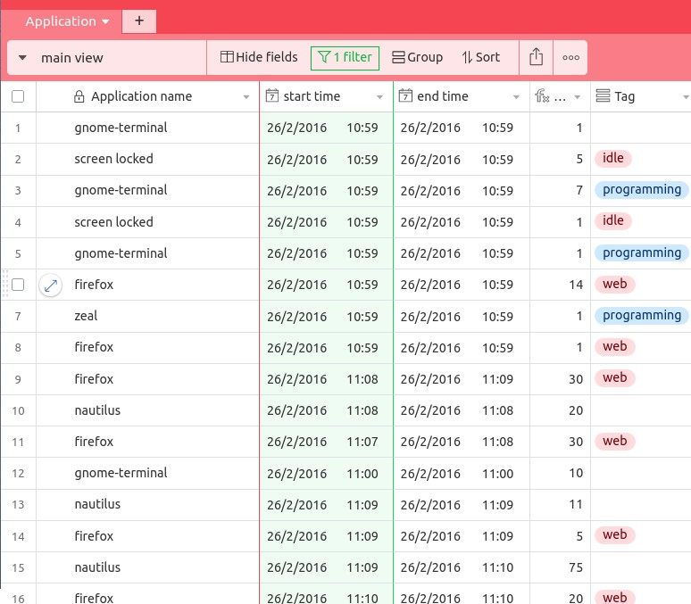
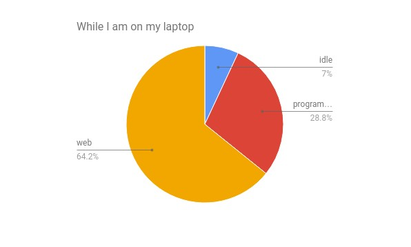
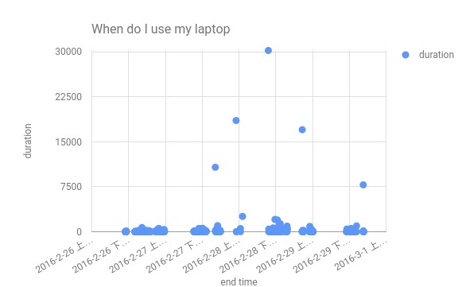
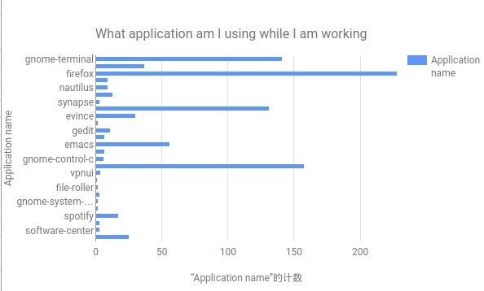

# What is this? 

A hacked up commandline app made with python that tracks my computer usage and pushes the usage statistics to Airtable using their API.

The app is the result of an attempt to better understand where I waste all my free time. 

# Results 
A sample of what I have collected on Airtable!

Gee, looks like I waste tones of time on surfing the web

Mostly using my laptop at night 

And the most used applications by total cumulative time. *This was pre-chrome era

